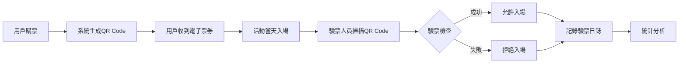
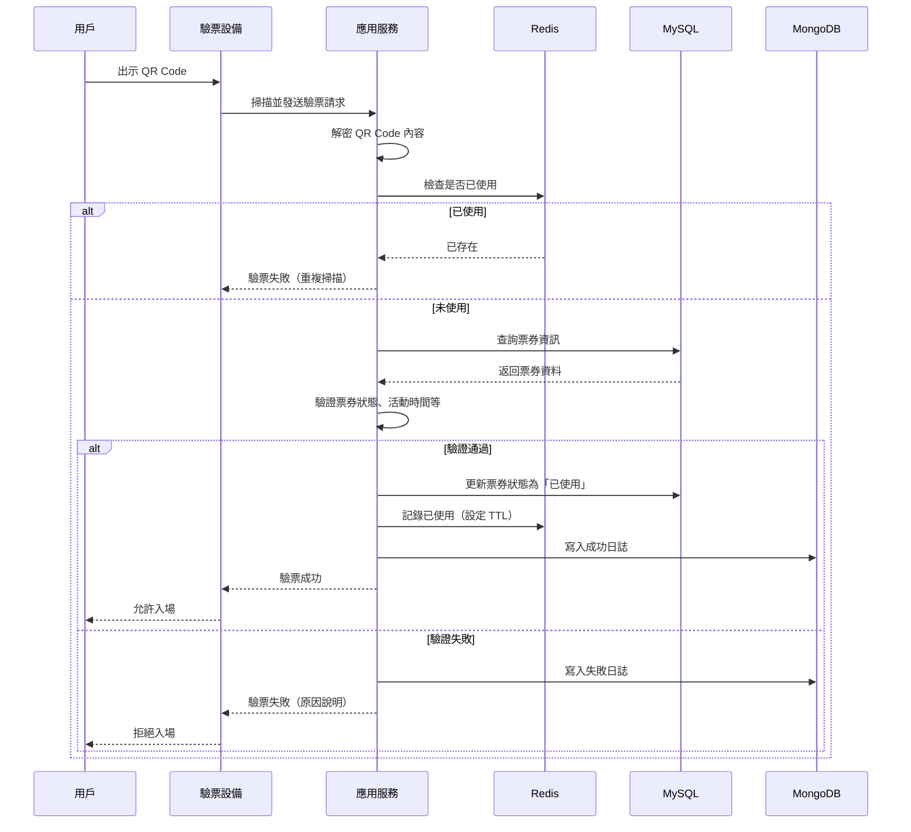

# QR 驗票系統 - 企業級後端專案

[](https://spring.io/projects/spring-boot)
[](https://www.oracle.com/java/)
[](LICENSE)

## 📋 專案簡介

本專案是一套完整的企業級 QR Code 驗票後端系統，專為演唱會、展覽、活動入場驗票場景設計，提供高效能、高安全性、高可用性的驗票解決方案。

### 🎯 系統背景

在現代大型活動中（演唱會、展覽、會議等），傳統紙質票券存在以下問題：
- **易偽造**：紙質票券容易被複製、偽造
- **難管理**：無法即時統計入場人數、驗票效率
- **體驗差**：排隊驗票時間長，用戶體驗不佳
- **成本高**：印刷、物流、人工驗票成本高

本系統透過 QR Code 電子票券 + 行動裝置掃描的方式，實現：
- ✅ **防偽造**：AES 加密 + JWT 簽名，無法偽造
- ✅ **防重複**：Redis 即時記錄，防止同一票券重複入場
- ✅ **即時統計**：MongoDB + Elasticsearch，即時分析入場數據
- ✅ **高效能**：每秒可處理數千次驗票請求
- ✅ **可追溯**：完整的驗票日誌，可審計、可分析

### 🏆 系統目標

1. **安全性**
   - QR Code 內容加密，防止偽造
   - JWT 認證授權，保護 API 安全
   - Redis 防重複掃描，杜絕多次入場
   - 完整的審計日誌，可追溯每一次驗票

2. **高效能**
   - MySQL 主資料 + Redis 快取，毫秒級響應
   - MongoDB 異步寫入日誌，不影響驗票速度
   - Elasticsearch 分散式搜尋，快速查詢海量日誌

3. **易擴展**
   - 微服務架構，支援水平擴展
   - 資料庫分離（讀寫分離、業務分離）
   - 容器化部署，支援 Kubernetes

4. **易維護**
   - 完整的中文註釋，降低維護成本
   - 清晰的模組劃分，降低耦合度
   - 詳盡的文件，快速上手

### 💼 商業流程說明



1. **售票階段**
   - 用戶在售票平台購買票券
   - 系統為每張票券生成唯一的 QR Code
   - 用戶收到電子票券（郵件/簡訊/App）

2. **驗票階段**
   - 活動當天，用戶到達現場
   - 驗票人員使用手機/平板掃描 QR Code
   - 系統即時驗證票券有效性
   - 驗票成功：開啟閘門/蓋章，允許入場
   - 驗票失敗：提示失敗原因，拒絕入場

3. **統計階段**
   - 即時監控入場人數、各門入場狀況
   - 分析熱門時段、VIP 入場率等數據
   - 為下次活動提供數據支撐

### 🔒 安全驗票必要性

1. **防止黃牛票**
   - 票券綁定用戶身份，無法轉讓（可選）
   - 即時驗證票券來源，識別假票

2. **防止重複入場**
   - Redis 記錄已使用票券，防止重複掃描
   - 限時 QR Code，定期刷新，防止截圖使用

3. **數據安全**
   - 所有 API 使用 HTTPS 加密傳輸
   - 敏感資料（密碼）使用 BCrypt 加密
   - JWT Token 防止 Session 劫持

### 🌟 企業安全票務平台特性

#### 1. 多層次安全防護
- **傳輸層**：HTTPS 加密
- **應用層**：JWT 認證 + Spring Security 授權
- **資料層**：AES 加密 QR Code 內容
- **業務層**：Redis 防重複 + 限時票券

#### 2. 高可用架構
- **資料庫主從**：MySQL 讀寫分離
- **快取集群**：Redis Sentinel/Cluster
- **搜尋集群**：Elasticsearch 集群
- **應用集群**：Nginx 負載均衡 + 多實例

#### 3. 完整的監控體系
- **應用監控**：Spring Boot Actuator
- **日誌監控**：ELK（Elasticsearch + Logstash + Kibana）
- **效能監控**：Prometheus + Grafana
- **業務監控**：即時驗票統計、成功率分析

#### 4. 靈活的業務配置
- **多種票券類型**：一般票、VIP、工作人員票等
- **多種驗票模式**：永久有效、限時有效、一次性
- **多設備支援**：手機、平板、專用掃描器
- **多場景支援**：演唱會、展覽、會議、體育賽事

## 🛠 技術棧

| 技術                  | 版本    | 說明                      |
|---------------------|-------|-------------------------|
| Java                | 17    | 程式語言                    |
| Spring Boot         | 3.2.0 | 主後端框架                   |
| Spring Security     | 6.x   | 安全框架（認證授權）              |
| Spring Data JPA     | 3.x   | ORM 框架                  |
| MySQL               | 8.0   | 主資料庫（活動、票券、用戶）          |
| MongoDB             | 6.0   | NoSQL 資料庫（驗票日誌）         |
| Redis               | 7.0   | 記憶體快取（防重複、限時票券）         |
| Elasticsearch       | 8.x   | 搜尋引擎（日誌搜尋、統計分析）         |
| JWT (JJWT)          | 0.12  | JWT Token 生成與驗證         |
| ZXing               | 3.5   | QR Code 生成              |
| Lombok              | 1.18  | 簡化程式碼                   |
| Docker              | 24.x  | 容器化部署                   |
| Docker Compose      | 2.x   | 多容器編排                   |

詳細的技術棧說明請參考：[docs/architecture.md](docs/architecture.md)

## 📂 專案結構

```
QR-Ticket-Verification-Backend-System/
├── src/main/java/com/qrticket/
│   ├── config/               # 配置類別
│   │   ├── SecurityConfig.java      # Spring Security 配置
│   │   └── RedisConfig.java         # Redis 配置
│   ├── controller/           # API 控制器
│   │   ├── VerificationController.java  # 驗票 API
│   │   └── QRCodeController.java        # QR Code API
│   ├── dto/                  # 資料傳輸物件
│   │   ├── request/          # 請求 DTO
│   │   └── response/         # 響應 DTO
│   ├── entity/               # 實體類別
│   │   ├── Event.java               # 活動實體
│   │   ├── Ticket.java              # 票券實體
│   │   ├── TicketType.java          # 票券類型實體
│   │   ├── User.java                # 用戶實體
│   │   ├── Device.java              # 設備實體
│   │   └── VerificationLog.java     # 驗票日誌（MongoDB）
│   ├── repository/           # 資料存取層
│   │   ├── jpa/              # JPA Repository
│   │   └── mongodb/          # MongoDB Repository
│   ├── service/              # 業務邏輯層
│   │   ├── VerificationService.java # 驗票服務（核心）
│   │   └── QRCodeService.java       # QR Code 服務
│   ├── security/             # 安全相關
│   ├── utils/                # 工具類別
│   │   ├── QRCodeUtil.java          # QR Code 工具
│   │   ├── RedisUtil.java           # Redis 工具
│   │   ├── EncryptionUtil.java      # 加密工具
│   │   └── JwtUtil.java             # JWT 工具
│   ├── exception/            # 異常處理
│   └── QrTicketApplication.java     # 主程式入口
├── src/main/resources/
│   ├── application.yml       # 主配置檔案
│   └── logback-spring.xml    # 日誌配置（可選）
├── docs/                     # 文件目錄
│   ├── architecture.md       # 架構設計文件
│   ├── db_mysql.md          # MySQL 資料庫設計
│   ├── mongo_logs.md        # MongoDB 日誌設計
│   ├── es_search.md         # Elasticsearch 搜尋設計
│   ├── api.md               # API 文件
│   ├── qrcode_design.md     # QR Code 設計文件
│   ├── security.md          # 安全設計文件
│   └── deploy.md            # 部署文件
├── scripts/                  # 腳本目錄
│   ├── init_db.sql          # 資料庫初始化腳本
│   └── deploy.sh            # 部署腳本
├── docker-compose.yml        # Docker Compose 配置
├── Dockerfile               # Docker 鏡像配置
├── pom.xml                  # Maven 配置
└── README.md                # 本文件
```

## 🚀 快速開始

### 前置需求

- Java 17+
- Maven 3.8+
- Docker 24.x+
- Docker Compose 2.x+

### 方式一：Docker Compose（推薦）

1. **克隆專案**
   ```bash
   git clone https://github.com/your-repo/qr-ticket-verification-system.git
   cd qr-ticket-verification-system
   ```

2. **啟動所有服務**
   ```bash
   docker-compose up -d
   ```

   這將啟動以下服務：
   - MySQL（埠 3306）
   - MongoDB（埠 27017）
   - Redis（埠 6379）
   - Elasticsearch（埠 9200）
   - Kibana（埠 5601）
   - 應用程式（埠 8080）

3. **檢查服務狀態**
   ```bash
   docker-compose ps
   ```

4. **訪問服務**
   - API：http://localhost:8080/api
   - 健康檢查：http://localhost:8080/api/actuator/health
   - Kibana：http://localhost:5601

### 方式二：本地開發

1. **安裝依賴服務**
   ```bash
   # MySQL
   docker run -d --name mysql -p 3306:3306 \
     -e MYSQL_ROOT_PASSWORD=root123 \
     -e MYSQL_DATABASE=qr_ticket_db \
     mysql:8.0

   # MongoDB
   docker run -d --name mongodb -p 27017:27017 \
     -e MONGO_INITDB_ROOT_USERNAME=admin \
     -e MONGO_INITDB_ROOT_PASSWORD=admin123 \
     mongo:6.0

   # Redis
   docker run -d --name redis -p 6379:6379 redis:7.0

   # Elasticsearch
   docker run -d --name elasticsearch -p 9200:9200 \
     -e "discovery.type=single-node" \
     -e "ELASTIC_PASSWORD=elastic123" \
     elasticsearch:8.11.0
   ```

2. **編譯專案**
   ```bash
   mvn clean package -DskipTests
   ```

3. **運行應用程式**
   ```bash
   java -jar target/qr-ticket-verification-system-1.0.0.jar
   ```

4. **或使用 Maven 運行**
   ```bash
   mvn spring-boot:run
   ```

## 📖 文件導覽

| 文件              | 說明                         | 連結                              |
|-----------------|----------------------------|--------------------------------- |
| 架構設計          | 系統架構、技術選型、設計理念           | [architecture.md](docs/architecture.md)   |
| MySQL 資料庫設計  | 資料表結構、索引、關聯關係、ERD 圖      | [db_mysql.md](docs/db_mysql.md)           |
| MongoDB 日誌設計  | 日誌結構、索引、查詢優化              | [mongo_logs.md](docs/mongo_logs.md)       |
| Elasticsearch    | 搜尋配置、分析查詢、聚合統計           | [es_search.md](docs/es_search.md)         |
| API 文件         | 所有 API 端點、請求/響應格式         | [api.md](docs/api.md)                     |
| QR Code 設計     | QR Code 生成、加密、TTL 策略       | [qrcode_design.md](docs/qrcode_design.md) |
| 安全設計          | 認證授權、加密、防重複、審計日誌         | [security.md](docs/security.md)           |
| 部署文件          | Docker 部署、Rocky Linux 安裝    | [deploy.md](docs/deploy.md)               |

## 🔑 核心功能

### 1. 驗票流程



### 2. QR Code 生成

- **純文字格式**：票券代碼（TKT2024010112345678）
- **AES 加密格式**：AES(票券代碼) -> Base64
- **限時 QR Code**：設定過期時間，定期刷新
- **一次性 QR Code**：掃描後立即失效

### 3. Redis 防重複策略

```
Key: qr:ticket:{ticketId}:used
Value: 驗票時間戳
TTL: 活動結束後 24 小時
```

### 4. MongoDB 日誌記錄

每次驗票操作都會記錄：
- 票券資訊（ID、代碼、類型）
- 活動資訊（ID、名稱）
- 設備資訊（ID、名稱、門號）
- 操作員資訊（ID、用戶名）
- 驗票結果（成功/失敗）
- 失敗原因（如果失敗）
- 時間戳、IP、GPS 位置等

### 5. Elasticsearch 統計分析

- 熱門時段分析
- 驗票成功率統計
- 門號人流分佈
- 全文搜尋日誌
- 時間範圍查詢

## 🎨 API 範例

### 驗票 API

```bash
POST /api/verification/verify
Content-Type: application/json

{
  "qrCodeContent": "TKT2024010112345678",
  "deviceCode": "DEV20240101123456",
  "operatorId": 1
}
```

**成功響應：**
```json
{
  "success": true,
  "message": "驗票成功",
  "data": {
    "ticketId": 123,
    "ticketCode": "TKT2024010112345678",
    "eventName": "五月天演唱會",
    "ticketType": "VIP",
    "seatNumber": "A區-10排-5號",
    "verifiedAt": "2024-01-01T19:30:00"
  },
  "timestamp": "2024-01-01T19:30:00"
}
```

**失敗響應：**
```json
{
  "success": false,
  "message": "票券已使用，使用時間: 2024-01-01T19:00:00",
  "errorCode": "TICKET_ALREADY_USED",
  "timestamp": "2024-01-01T19:30:00"
}
```

更多 API 請參考：[docs/api.md](docs/api.md)

## 🧪 測試

```bash
# 運行所有測試
mvn test

# 運行特定測試
mvn test -Dtest=VerificationServiceTest

# 生成測試報告
mvn test jacoco:report
```

## 📊 效能指標

- **驗票響應時間**：< 100ms（平均）
- **QR Code 生成時間**：< 5ms
- **並發處理能力**：5000 請求/秒（單實例）
- **資料庫查詢時間**：< 10ms（有索引）
- **Redis 讀寫時間**：< 1ms

## 🔐 安全性

- ✅ HTTPS 加密傳輸
- ✅ JWT 認證授權
- ✅ AES 加密 QR Code
- ✅ BCrypt 密碼加密
- ✅ Redis 防重複掃描
- ✅ API 限流（防 DDoS）
- ✅ SQL 注入防護（JPA）
- ✅ XSS 防護
- ✅ CORS 跨域控制

## 📝 License

本專案採用 MIT License。詳見 [LICENSE](LICENSE) 文件。

## 👥 貢獻

歡迎提交 Issue 和 Pull Request！

## 📧 聯絡方式

如有問題，請聯絡：qr-ticket-system@example.com

---

**開發團隊：QR Ticket System Team**
**最後更新：2024-01-01**
