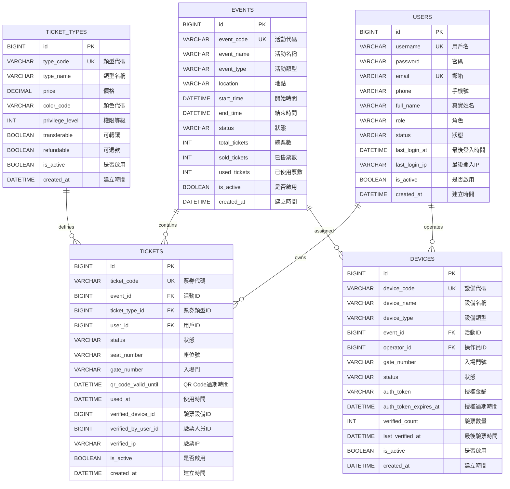

# MySQL 資料庫設計文件

## 📊 ERD 實體關聯圖



## 📋 資料表詳細設計

### 1. events（活動表）

**功能說明：** 儲存演唱會、展覽、活動的基本資訊

**表格結構：**

| 欄位名稱           | 資料型別        | 長度  | 可空  | 預設值 | 說明           |
|----------------|-------------|-----|-----|-----|--------------|
| id             | BIGINT      | -   | NO  | AI  | 主鍵（自增）       |
| event_code     | VARCHAR     | 20  | NO  | -   | 活動代碼（唯一）     |
| event_name     | VARCHAR     | 200 | NO  | -   | 活動名稱         |
| description    | TEXT        | -   | YES | -   | 活動描述         |
| event_type     | VARCHAR     | 50  | NO  | -   | 活動類型         |
| location       | VARCHAR     | 500 | NO  | -   | 活動地點         |
| start_time     | DATETIME    | -   | NO  | -   | 開始時間         |
| end_time       | DATETIME    | -   | NO  | -   | 結束時間         |
| status         | VARCHAR     | 20  | NO  | -   | 狀態           |
| total_tickets  | INT         | -   | NO  | -   | 總票數          |
| sold_tickets   | INT         | -   | NO  | 0   | 已售票數         |
| used_tickets   | INT         | -   | NO  | 0   | 已使用票數        |
| organizer      | VARCHAR     | 200 | YES | -   | 主辦單位         |
| contact_phone  | VARCHAR     | 20  | YES | -   | 聯絡電話         |
| contact_email  | VARCHAR     | 100 | YES | -   | 聯絡郵箱         |
| is_active      | BOOLEAN     | -   | NO  | 1   | 是否啟用（軟刪除）    |
| created_at     | DATETIME    | -   | NO  | NOW | 建立時間         |
| updated_at     | DATETIME    | -   | YES | -   | 更新時間         |

**索引設計：**

```sql
-- 主鍵索引
PRIMARY KEY (id)

-- 唯一索引
UNIQUE INDEX idx_event_code (event_code)

-- 普通索引
INDEX idx_status (status)
INDEX idx_start_time (start_time)
INDEX idx_end_time (end_time)
```

**設計理由：**
1. **event_code 唯一索引**：快速查詢特定活動，避免重複
2. **status 索引**：常用於篩選進行中的活動
3. **時間索引**：常用於查詢時間範圍內的活動

**適用情境：**
- 查詢進行中的活動
- 統計各狀態活動數量
- 根據時間範圍查詢活動

**建表 SQL：**

```sql
CREATE TABLE events (
    id BIGINT AUTO_INCREMENT PRIMARY KEY COMMENT '活動 ID',
    event_code VARCHAR(20) NOT NULL UNIQUE COMMENT '活動代碼',
    event_name VARCHAR(200) NOT NULL COMMENT '活動名稱',
    description TEXT COMMENT '活動描述',
    event_type VARCHAR(50) NOT NULL COMMENT '活動類型',
    location VARCHAR(500) NOT NULL COMMENT '活動地點',
    start_time DATETIME NOT NULL COMMENT '開始時間',
    end_time DATETIME NOT NULL COMMENT '結束時間',
    status VARCHAR(20) NOT NULL COMMENT '狀態',
    total_tickets INT NOT NULL COMMENT '總票數',
    sold_tickets INT NOT NULL DEFAULT 0 COMMENT '已售票數',
    used_tickets INT NOT NULL DEFAULT 0 COMMENT '已使用票數',
    organizer VARCHAR(200) COMMENT '主辦單位',
    contact_phone VARCHAR(20) COMMENT '聯絡電話',
    contact_email VARCHAR(100) COMMENT '聯絡郵箱',
    is_active BOOLEAN NOT NULL DEFAULT 1 COMMENT '是否啟用',
    created_at DATETIME NOT NULL DEFAULT CURRENT_TIMESTAMP COMMENT '建立時間',
    updated_at DATETIME ON UPDATE CURRENT_TIMESTAMP COMMENT '更新時間',
    INDEX idx_event_code (event_code),
    INDEX idx_status (status),
    INDEX idx_start_time (start_time),
    INDEX idx_end_time (end_time)
) ENGINE=InnoDB DEFAULT CHARSET=utf8mb4 COMMENT='活動表';
```

### 2. tickets（票券表）

**功能說明：** 儲存每張票券的詳細資訊

**表格結構：**

| 欄位名稱                   | 資料型別     | 長度 | 可空  | 預設值    | 說明         |
|------------------------|----------|----|----- |--------|------------|
| id                     | BIGINT   | -  | NO   | AI     | 主鍵（自增）     |
| ticket_code            | VARCHAR  | 30 | NO   | -      | 票券代碼（唯一）   |
| event_id               | BIGINT   | -  | NO   | -      | 活動 ID（外鍵） |
| ticket_type_id         | BIGINT   | -  | NO   | -      | 票券類型 ID    |
| user_id                | BIGINT   | -  | YES  | -      | 用戶 ID（外鍵） |
| status                 | VARCHAR  | 20 | NO   | UNUSED | 狀態         |
| seat_number            | VARCHAR  | 50 | YES  | -      | 座位號        |
| gate_number            | VARCHAR  | 50 | YES  | -      | 入場門號       |
| qr_code_valid_until    | DATETIME | -  | YES  | -      | QR 過期時間    |
| used_at                | DATETIME | -  | YES  | -      | 使用時間       |
| verified_device_id     | BIGINT   | -  | YES  | -      | 驗票設備 ID    |
| verified_by_user_id    | BIGINT   | -  | YES  | -      | 驗票人員 ID    |
| verified_ip            | VARCHAR  | 50 | YES  | -      | 驗票 IP      |
| purchased_at           | DATETIME | -  | YES  | -      | 購買時間       |
| order_number           | VARCHAR  | 50 | YES  | -      | 訂單編號       |
| note                   | TEXT     | -  | YES  | -      | 備註         |
| is_active              | BOOLEAN  | -  | NO   | 1      | 是否啟用       |
| created_at             | DATETIME | -  | NO   | NOW    | 建立時間       |
| updated_at             | DATETIME | -  | YES  | -      | 更新時間       |

**索引設計：**

```sql
-- 主鍵索引
PRIMARY KEY (id)

-- 唯一索引
UNIQUE INDEX idx_ticket_code (ticket_code)

-- 普通索引
INDEX idx_event_id (event_id)
INDEX idx_user_id (user_id)
INDEX idx_status (status)

-- 複合索引（常用查詢組合）
INDEX idx_event_status (event_id, status)
INDEX idx_user_status (user_id, status)

-- 外鍵索引
FOREIGN KEY (event_id) REFERENCES events(id)
FOREIGN KEY (ticket_type_id) REFERENCES ticket_types(id)
FOREIGN KEY (user_id) REFERENCES users(id)
```

**建表 SQL：**

```sql
CREATE TABLE tickets (
    id BIGINT AUTO_INCREMENT PRIMARY KEY COMMENT '票券 ID',
    ticket_code VARCHAR(30) NOT NULL UNIQUE COMMENT '票券代碼',
    event_id BIGINT NOT NULL COMMENT '活動 ID',
    ticket_type_id BIGINT NOT NULL COMMENT '票券類型 ID',
    user_id BIGINT COMMENT '用戶 ID',
    status VARCHAR(20) NOT NULL DEFAULT 'UNUSED' COMMENT '狀態',
    seat_number VARCHAR(50) COMMENT '座位號',
    gate_number VARCHAR(50) COMMENT '入場門號',
    qr_code_valid_until DATETIME COMMENT 'QR Code 過期時間',
    used_at DATETIME COMMENT '使用時間',
    verified_device_id BIGINT COMMENT '驗票設備 ID',
    verified_by_user_id BIGINT COMMENT '驗票人員 ID',
    verified_ip VARCHAR(50) COMMENT '驗票 IP',
    purchased_at DATETIME COMMENT '購買時間',
    order_number VARCHAR(50) COMMENT '訂單編號',
    note TEXT COMMENT '備註',
    is_active BOOLEAN NOT NULL DEFAULT 1 COMMENT '是否啟用',
    created_at DATETIME NOT NULL DEFAULT CURRENT_TIMESTAMP COMMENT '建立時間',
    updated_at DATETIME ON UPDATE CURRENT_TIMESTAMP COMMENT '更新時間',
    INDEX idx_ticket_code (ticket_code),
    INDEX idx_event_id (event_id),
    INDEX idx_user_id (user_id),
    INDEX idx_status (status),
    INDEX idx_event_status (event_id, status),
    FOREIGN KEY (event_id) REFERENCES events(id),
    FOREIGN KEY (ticket_type_id) REFERENCES ticket_types(id),
    FOREIGN KEY (user_id) REFERENCES users(id)
) ENGINE=InnoDB DEFAULT CHARSET=utf8mb4 COMMENT='票券表';
```

### 3. ticket_types（票券類型表）

**建表 SQL：**

```sql
CREATE TABLE ticket_types (
    id BIGINT AUTO_INCREMENT PRIMARY KEY COMMENT '票券類型 ID',
    type_code VARCHAR(50) NOT NULL UNIQUE COMMENT '類型代碼',
    type_name VARCHAR(100) NOT NULL COMMENT '類型名稱',
    description TEXT COMMENT '描述',
    price DECIMAL(10,2) NOT NULL COMMENT '價格',
    color_code VARCHAR(7) COMMENT '顏色代碼',
    privilege_level INT NOT NULL COMMENT '權限等級',
    transferable BOOLEAN NOT NULL DEFAULT 1 COMMENT '可轉讓',
    refundable BOOLEAN NOT NULL DEFAULT 1 COMMENT '可退款',
    sort_order INT DEFAULT 0 COMMENT '排序',
    is_active BOOLEAN NOT NULL DEFAULT 1 COMMENT '是否啟用',
    created_at DATETIME NOT NULL DEFAULT CURRENT_TIMESTAMP COMMENT '建立時間',
    updated_at DATETIME ON UPDATE CURRENT_TIMESTAMP COMMENT '更新時間',
    INDEX idx_type_code (type_code)
) ENGINE=InnoDB DEFAULT CHARSET=utf8mb4 COMMENT='票券類型表';
```

### 4. users（用戶表）

**建表 SQL：**

```sql
CREATE TABLE users (
    id BIGINT AUTO_INCREMENT PRIMARY KEY COMMENT '用戶 ID',
    username VARCHAR(50) NOT NULL UNIQUE COMMENT '用戶名',
    password VARCHAR(100) NOT NULL COMMENT '密碼（BCrypt 加密）',
    email VARCHAR(100) NOT NULL UNIQUE COMMENT '郵箱',
    phone VARCHAR(20) COMMENT '手機號',
    full_name VARCHAR(100) COMMENT '真實姓名',
    role VARCHAR(20) NOT NULL DEFAULT 'USER' COMMENT '角色',
    status VARCHAR(20) NOT NULL DEFAULT 'ACTIVE' COMMENT '狀態',
    avatar_url VARCHAR(500) COMMENT '頭像 URL',
    last_login_at DATETIME COMMENT '最後登入時間',
    last_login_ip VARCHAR(50) COMMENT '最後登入 IP',
    login_failure_count INT DEFAULT 0 COMMENT '登入失敗次數',
    locked_until DATETIME COMMENT '鎖定時間',
    is_active BOOLEAN NOT NULL DEFAULT 1 COMMENT '是否啟用',
    created_at DATETIME NOT NULL DEFAULT CURRENT_TIMESTAMP COMMENT '建立時間',
    updated_at DATETIME ON UPDATE CURRENT_TIMESTAMP COMMENT '更新時間',
    INDEX idx_username (username),
    INDEX idx_email (email),
    INDEX idx_phone (phone),
    INDEX idx_role (role)
) ENGINE=InnoDB DEFAULT CHARSET=utf8mb4 COMMENT='用戶表';
```

### 5. devices（設備表）

**建表 SQL：**

```sql
CREATE TABLE devices (
    id BIGINT AUTO_INCREMENT PRIMARY KEY COMMENT '設備 ID',
    device_code VARCHAR(20) NOT NULL UNIQUE COMMENT '設備代碼',
    device_name VARCHAR(100) NOT NULL COMMENT '設備名稱',
    device_type VARCHAR(50) NOT NULL COMMENT '設備類型',
    event_id BIGINT COMMENT '活動 ID',
    operator_id BIGINT COMMENT '操作員 ID',
    gate_number VARCHAR(50) COMMENT '入場門號',
    status VARCHAR(20) NOT NULL DEFAULT 'ACTIVE' COMMENT '狀態',
    mac_address VARCHAR(50) COMMENT 'MAC 位址',
    ip_address VARCHAR(50) COMMENT 'IP 位址',
    serial_number VARCHAR(100) COMMENT '設備序號',
    model VARCHAR(100) COMMENT '設備型號',
    os_info VARCHAR(200) COMMENT '作業系統',
    auth_token VARCHAR(500) COMMENT '授權金鑰',
    auth_token_expires_at DATETIME COMMENT '授權過期時間',
    verified_count INT DEFAULT 0 COMMENT '驗票數量',
    last_verified_at DATETIME COMMENT '最後驗票時間',
    last_online_at DATETIME COMMENT '最後線上時間',
    note TEXT COMMENT '備註',
    is_active BOOLEAN NOT NULL DEFAULT 1 COMMENT '是否啟用',
    created_at DATETIME NOT NULL DEFAULT CURRENT_TIMESTAMP COMMENT '建立時間',
    updated_at DATETIME ON UPDATE CURRENT_TIMESTAMP COMMENT '更新時間',
    INDEX idx_device_code (device_code),
    INDEX idx_event_id (event_id),
    INDEX idx_status (status),
    FOREIGN KEY (event_id) REFERENCES events(id),
    FOREIGN KEY (operator_id) REFERENCES users(id)
) ENGINE=InnoDB DEFAULT CHARSET=utf8mb4 COMMENT='設備表';
```

## 📈 效能優化建議

### 1. 索引優化
- 為常用查詢欄位建立索引
- 使用複合索引覆蓋多欄位查詢
- 避免過多索引（影響寫入效能）

### 2. 資料分割
- 按月分割 tickets 表（歷史資料）
- 按年分割 events 表

### 3. 讀寫分離
- 主庫：寫入操作
- 從庫：查詢操作

### 4. 快取策略
- Redis 快取熱門活動
- Redis 快取用戶資訊

## 🔒 安全性建議

1. **密碼加密**：使用 BCrypt
2. **SQL 注入防護**：使用 JPA 參數化查詢
3. **敏感資料**：加密儲存
4. **定期備份**：每日全量備份 + 實時增量備份

---

**文件版本：1.0.0**
**最後更新：2024-01-01**
